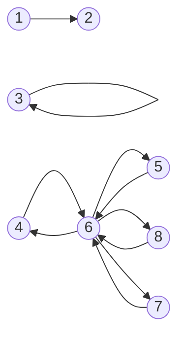

# Recuento de componentes conectados

Escribe una función, `connectedComponentsCount`, que reciba la lista de adyacencia de un **grafo no dirigido**. La función debe devolver el número de componentes conectados dentro del grafo.

