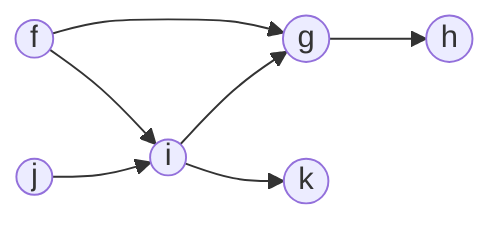

# Tiene ruta

Escribe una función, `hasPath`, que reciba un objeto que represente la lista de adyacencia de un grafo acíclico dirigido y dos nodos (origen, destino). La función debe devolver un booleano que indique si existe o no una ruta dirigida entre los nodos de origen y destino.

Oye. Este es nuestro primer problema de grafos, así que deberías ser generoso viendo el enfoque y el recorrido. Sé productivo, no testarudo. -AZ

