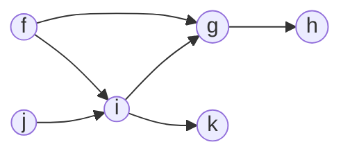

# Has Path

Escribe una función, `hasPath`, que reciba un objeto que represente la lista de adyacente de un grafo no cíclico dirigido y dos nodos (origen, destino). La función debe devolver un booleano que indique si existe o no una ruta dirigida entre los nodos de origen y destino.



## Código

```text
graph = {
  f: ['g', 'i'],
  g: ['h'],
  h: [],
  i: ['g', 'k'],
  j: ['i'],
  k: [],
};

'f' -> 'h'

CURRENT:      f     g     i     h
QUEUE:    f   i g   h i   k h
```

```typescript
type GraphType = Record<string, string[]>;

const getProperty = <K extends keyof O, O>(key: K, obj: O) => {
  return obj[key];
};

/**
 * No recursive version
 */
export const hasPath = (sourceNode: string, destinationNode: string, graph: GraphType) => {
  const queue: string[] = [sourceNode];

  while (queue.length > 0) {
    const current = queue.shift();

    if (current === destinationNode) {
      return true;
    }

    if (current) {
      const neighbors = getProperty(current, graph);

      if (neighbors.length > 0) {
        for (let neighbor of neighbors) {
          queue.push(neighbor);
        }
      }
    }
  }

  return false;
};

/**
 * Recursive version
 *
export const hasPath = (sourceNode: string, destinationNode: string, graph: GraphType) => {
  if (sourceNode === destinationNode) {
    return true;
  }

  const neighbors = getProperty(sourceNode, graph);

  if (neighbors) {
    for (const neighbor of neighbors) {
      const existValidPath = hasPath(graph, neighbor, destinationNode);

      if (existValidPath) {
        return true;
      }
    }
  }

  return false;
};
*/
```

## Código fuente
[Codigo fuente](./has-path.ts)

## Tests
[Codigo de tests](./has-path.test.ts)
