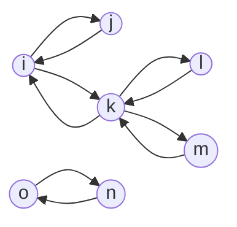

# Undirected path (Ruta no dirigida)

Escribe una función, `undirectedPath`, que reciba un array de aristas para un grafo no dirigido y dos nodos (nodoA, nodoB). La función debe devolver un booleano que indique si existe o no una ruta entre `nodeA` y `nodeB`.



## Código

```typescript
const buildGraphByEdges = (edges: EdgeType[]): GraphType => {
  const graph: GraphType = {};

  for (const edge of edges) {
    const [a, b] = edge;
    const aInGraph = a in graph;
    const bInGraph = b in graph;

    if (!aInGraph) {
      graph[a] = [];
    }

    if (!bInGraph) {
      graph[b] = [];
    }

    graph[a].push(b);
    graph[b].push(a);
  }

  return graph;
};

type EdgeType = [string, string];

type GraphType = Record<string, string[]>;

const getProperty = <K extends keyof O, O>(key: K, obj: O) => {
  return obj[key];
};

/**
 * Recursive version
 */
const hasPath = (sourceNode: string, destinationNode: string, visited: Set<string>, graph: GraphType): boolean => {
  if (sourceNode === destinationNode) {
    return true;
  }

  if (visited.has(sourceNode)) {
    return false;
  }

  visited.add(sourceNode);

  const neighbors = getProperty(sourceNode, graph);

  if (neighbors && neighbors?.length > 0) {
    for (const neighbor of neighbors) {
      const neighborToDestinationPathExist = hasPath(neighbor, destinationNode, visited, graph);

      if (neighborToDestinationPathExist) {
        return true;
      }
    }
  }

  return false;
};

export const undirectedPath = (nodeA: string, nodeB: string, edges: EdgeType[]) => {
  const graph = buildGraphByEdges(edges);
  const visited = new Set<string>();

  return hasPath(nodeA, nodeB, visited, graph);
};
```

## Código fuente
[Codigo fuente](./undirected-path.ts)

## Tests
[Codigo de tests](./undirected-path.test.ts)
