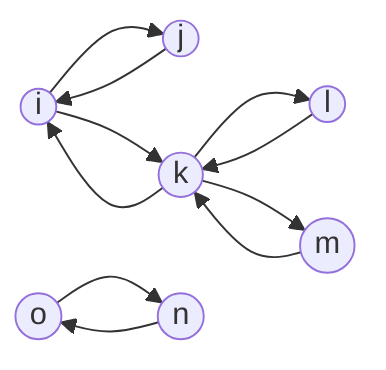

# Ruta no dirigida

Escribe una función, `undirectedPath`, que reciba un array de aristas para un grafo no dirigido y dos nodos (nodoA, nodoB). La función debe devolver un booleano que indique si existe o no una ruta entre `nodeA` y `nodeB`.

