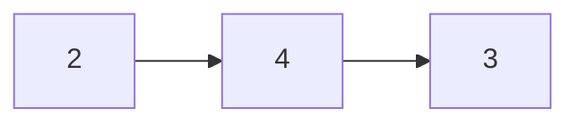
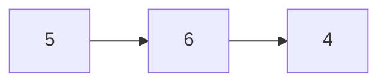
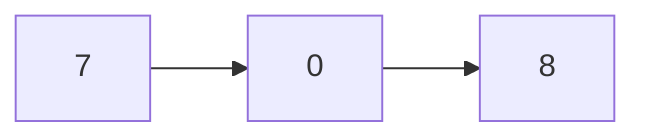

# Suma de dos números (Add Two Numbers)

## URL
[Enlace de Leet Code](https://leetcode.com/problems/add-two-numbers/)

Se te dan dos listas enlazadas no vacías que representan dos enteros no negativos.

Los dígitos se almacenan en orden inverso, y cada uno de sus nodos contiene un solo dígito.

Suma los dos números y devuelve la suma como una lista enlazada.

Puedes asumir que los dos números no contienen ningún cero a la izquierda, excepto el número 0.

**Ejemplo 1:**

Entradas:





Salidas:



```
Entrada: l1 = [2,4,3], l2 = [5,6,4]
Salida: [7,0,8]
```

Explicación: 342 + 465 = 807.

**Ejemplo 2:**

```
Entrada: l1 = [0], l2 = [0]
Salida: [0]
```

**Ejemplo 3:**

```
Entrada: l1 = [9,9,9,9,9,9,9], l2 = [9,9,9,9]
Salida: [8,9,9,9,0,0,0,1]
```

## Solución

```typescript
export type LinkedListNodeValue = number;

export type LinkedListNode = {
  val: LinkedListNodeValue;
  next: LinkedListNode | null;
};

export function createLinkedListNode(val?: LinkedListNodeValue, next?: LinkedListNode): LinkedListNode {
  return {
    val: val || 0,
    next: next || null,
  };
}

//        2   4   3
//        5   6   4
//        7   0   8

export function addTwoNumbers(
  linkedListNodeA: LinkedListNode | null,
  linkedListNodeB: LinkedListNode | null
): LinkedListNode | null {
  let sum = 0;
  let current = createLinkedListNode(0);
  let result = current;

  while (linkedListNodeA || linkedListNodeB) {
    if (linkedListNodeA) {
      sum += linkedListNodeA.val;
      linkedListNodeA = linkedListNodeA.next;
    }

    if (linkedListNodeB) {
      sum += linkedListNodeB.val;
      linkedListNodeB = linkedListNodeB.next;
    }

    current.next = createLinkedListNode(sum % 10);
    current = current.next;

    sum = sum > 9 ? 1 : 0;
  }

  if (sum) {
    current.next = createLinkedListNode(sum);
  }

  return result.next;
}
````

## Código
[add-two-numbers.ts](./add-two-numbers.ts)

## Tests
[add-two-numbers.test.ts](./add-two-numbers.test.ts)
