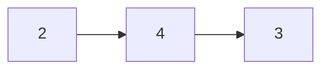
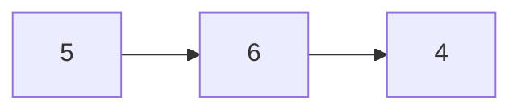
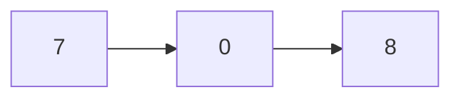

# Suma de dos números

[Enlace de Leet Code](https://leetcode.com/problems/add-two-numbers/)

Se te dan dos listas enlazadas no vacías que representan dos enteros no negativos.

Los dígitos se almacenan en orden inverso, y cada uno de sus nodos contiene un solo dígito.

Suma los dos números y devuelve la suma como una lista enlazada.

Puedes asumir que los dos números no contienen ningún cero a la izquierda, excepto el número 0.

**Ejemplo 1:**

Entradas:





Salidas:



```
Entrada: l1 = [2,4,3], l2 = [5,6,4]
Salida: [7,0,8]
```

Explicación: 342 + 465 = 807.

**Ejemplo 2:**

```
Entrada: l1 = [0], l2 = [0]
Salida: [0]
```

**Ejemplo 3:**

```
Entrada: l1 = [9,9,9,9,9,9,9], l2 = [9,9,9,9]
Salida: [8,9,9,9,0,0,0,1]
```

**Solución**

[Código Fuente](./addTwoNumbers.ts)
[Código de Pruebas](./addTwoNumbers.test.ts)