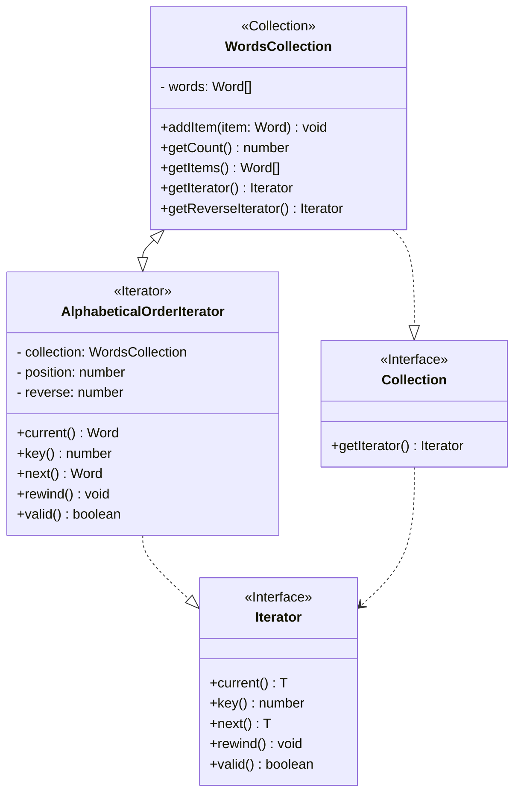

- [El patron Iterator](#el-patron-iterator)
  - [Usando el patrón Iterator](#usando-el-patr%C3%B3n-iterator)
  - [Estructura](#estructura)
  - [Ejemplo](#ejemplo)
  - [Ejemplo en vivo](#ejemplo-en-vivo)
  - [Ejemplo de código](#ejemplo-de-c%C3%B3digo)

# El patron Iterator

Iterator es un patrón de diseño de comportamiento que te permite recorrer elementos de una colección sin exponer su representación subyacente (lista, pila, árbol, etc.).

El patrón Iterator permite a los clientes recorrer eficazmente una colección de objetos.

## Usando el patrón Iterator

Una tarea común de programación es recorrer y manipular una colección de objetos. Estas colecciones pueden almacenarse como un array o quizás algo más complejo, como una estructura de árbol o gráfico. Además, es posible que necesites acceder a los elementos de la colección en un cierto orden, como de adelante hacia atrás, de atrás hacia adelante, en profundidad (como en búsquedas en árboles), omitiendo objetos de número par, etc.

El patrón de diseño Iterator resuelve este problema al separar la colección de objetos de la iteración de estos objetos mediante la implementación de un iterador especializado.

Hoy en día, muchos lenguajes tienen iteradores integrados al soportar construcciones del tipo `for-each` y las interfaces IEnumerable e IEnumerator. Sin embargo, JavaScript solo soporta bucles básicos en forma de for, `for-in`, `while` y `do while`.

La idea central del patrón Iterator es extraer el comportamiento de recorrido de una colección y colocarlo en un objeto independiente llamado iterador.

Además de implementar el propio algoritmo, un objeto iterador encapsula todos los detalles del recorrido, como la posición actual y cuántos elementos quedan hasta el final. Debido a esto, varios iteradores pueden recorrer la misma colección al mismo tiempo, independientemente los unos de los otros.

Normalmente, los iteradores aportan un método principal para extraer elementos de la colección. El cliente puede continuar ejecutando este método hasta que no devuelva nada, lo que significa que el iterador ha recorrido todos los elementos.

Todos los iteradores deben implementar la misma interfaz. Esto hace que el código cliente sea compatible con cualquier tipo de colección o cualquier algoritmo de recorrido, siempre y cuando exista un iterador adecuado.

Usar el patrón Iterator aporta varias ventajas:

- `Principio de responsabilidad única`. Puedes limpiar el código cliente y las colecciones extrayendo algoritmos de recorrido voluminosos y colocándoles en clases independientes.
- `Principio de abierto/cerrado`. Puedes implementar nuevos tipos de colecciones e iteradores y pasarlos al código existente sin descomponer nada.
- `Puedes recorrer la misma colección en paralelo` porque cada objeto iterador contiene su propio estado de iteración.
- `Por la misma razón, puedes retrasar una iteración` y continuar cuando sea necesario.

## Estructura



## Ejemplo

```typescript
/**
 * Iterator Design Pattern
 *
 * Intent: Lets you traverse elements of a collection without exposing its
 * underlying representation (list, stack, tree, etc.).
 */

interface MyIterator<T> {
  // Return the current element.
  current(): T;

  // Return the current element and move forward to next element.
  next(): T;

  // Return the key of the current element.
  key(): number;

  // Checks if current position is valid.
  valid(): boolean;

  // Rewind the Iterator to the first element.
  rewind(): void;
}

interface Aggregator {
  // Retrieve an external iterator.
  getIterator(): MyIterator<string>;
}

/**
 * Concrete Iterators implement various traversal algorithms. These classes
 * store the current traversal position at all times.
 */
class AlphabeticalOrderIterator implements MyIterator<string> {
  private collection: WordsCollection;

  /**
   * Stores the current traversal position. An iterator may have a lot of
   * other fields for storing iteration state, especially when it is supposed
   * to work with a particular kind of collection.
   */
  private position: number = 0;

  /**
   * This variable indicates the traversal direction.
   */
  private reverse: boolean = false;

  constructor(collection: WordsCollection, reverse: boolean = false) {
    this.collection = collection;
    this.reverse = reverse;

    if (reverse) {
      this.position = collection.getCount() - 1;
    }
  }

  public rewind() {
    this.position = this.reverse ? this.collection.getCount() - 1 : 0;
  }

  public current(): string {
    return this.collection.getItems()[this.position];
  }

  public key(): number {
    return this.position;
  }

  public next(): string {
    const item = this.collection.getItems()[this.position];
    this.position += this.reverse ? -1 : 1;
    return item;
  }

  public valid(): boolean {
    if (this.reverse) {
      return this.position >= 0;
    }

    return this.position < this.collection.getCount();
  }
}

/**
 * Concrete Collections provide one or several methods for retrieving fresh
 * iterator instances, compatible with the collection class.
 */
class WordsCollection implements Aggregator {
  private items: string[] = [];

  public getItems(): string[] {
    return this.items;
  }

  public getCount(): number {
    return this.items.length;
  }

  public addItem(item: string): void {
    this.items.push(item);
  }

  public getIterator(): MyIterator<string> {
    return new AlphabeticalOrderIterator(this);
  }

  public getReverseIterator(): MyIterator<string> {
    return new AlphabeticalOrderIterator(this, true);
  }
}

/**
 * The client code may or may not know about the Concrete Iterator or Collection
 * classes, depending on the level of indirection you want to keep in your
 * program.
 */
const collection = new WordsCollection();

collection.addItem('First');
collection.addItem('Second');
collection.addItem('Third');

const iterator = collection.getIterator();

console.log('Straight traversal:');

while (iterator.valid()) {
  console.log(iterator.next());
}

console.log('');
console.log('Reverse traversal:');

const reverseIterator = collection.getReverseIterator();

while (reverseIterator.valid()) {
  console.log(reverseIterator.next());
}
```

Output:

```text
Straight traversal:
First
Second
Third

Reverse traversal:
Third
Second
First
```

## Ejemplo en vivo

[Playground Link](https://www.typescriptlang.org/play/?#code/PQKhCgAIUhJAXApgJwIbwPbMgEUQZwEsBzAO0gAV0llSoJo5SlmAuSAGUXn0gE8MAV0jw0ANxT5EkRABtEAW0TNeGAGaRUkAMYZZ87fEIZyAd0LwAFkPgyAHgAcMRUsUgX89SINIATFLJ8hK6QyIgOYVLM6MbkABSyhPjwADSQyajaANZpooiIadzaAHQAlMX0wODgwTRqmdIAsnwIKOhYADwAKgB8kADeUJDAwJAAStyCtCKW0tpTYcwy8krMFZA6C8rwcaXsXQDc1Rsj45PTVnNbS3KK25p+kAoYEpBqWKaoyL4iGJCkiDstluq3g63+gJ2e0gh2Ow1GE3gU3Il0gWUQfEg6hmV2Qi2BK224PRfF27FIggUACMUEchqcAMKzbK8QgaeZ4+5OIhGEzuXhiVCJXzgwXCsmQKkYPSIVCkOknBGIcyPVGtNCYbCYHFvQjIZLLO5rIZhFW+CViDCEXxHAC+1VqKHq2iafAZegMvPIg0VZ1EhEQrzl9hopCF7ho7WQ4OI3HVUYlzXjmo6yWQwWIPTt1VADBg7tI2jCSDgkc1rIUDkJS0F6aEvFEqAk+vDQuIWAslgU+GKMNmUh0slQ+CknkYySw0lRHPxInEknD3IssU0tiFshEhCUPcq4G0Q5HkAAgrIHJZUDSjNohQB5b4oZNYdyV6s8SBJsudNMZvo+yARQhBRLXR9EQQxYnYAB1LBfHwd1QPAkwFWGMAhkYABlTUCB1Gd7kbZt8EXZxlxMXsj3ICw2k1J5UExc8g0gWQMFsdQ0JgZjZmwNQA1kWC3ifCd0xCSiNRXDIkEKfAHDAwh10xUxZgo2wknSQQHG5RBfDY35IFMLAsl0ztNH-L4r0EIdsCyYIfmxEDPVicFoCqDYAKA6Qly9clKRpbAAF5IAABmQ3NtK6SwVNrWSqXkdw-EIa8kAbWY5ybBcN18PUwK9RyQGc-90zc0JA0kRB2ClGVg38+pZCkZDdFINNBEMLA4jsrKIMgaDvjgj12pMNIwgI0rJWleRKreIUpFKAY0JmJJijaxDyH8xavSODYNisebBpKyB-J2-VEGQjY2UgOIDqmmaNo2raew8lcVt6pbiljeB3R8KFIAAWkgABGdaNvtDZ7SGBxBGi+KirNXYrpu8K7uIr09rmnsLukAB+FGFqe7LXve5gYZ+37IHYIKhhBlzwcSbRNk5AnoW-EI-w2YtkSx1aHNe1pu12ABtW7inukwAF0AYp-8qchkkJQpakUFhlnzhReHBcR2IxbhMGIZpgEgQlRm3GZnQTANSiFGRgWOdIrmkB50p+ZVoXSFF2aBadyAAGp-IFtHIExr7ifYf7ZtZ6YzY10HJZpsVrQlcqxu9WbTriH3isO6ajcVpELkdtW+R6fyyeu8Ws7Zt28-IDp2ZxznuHxqENZBkLGALItuGkeD7JN-KXmtaQTH77ApGbcMlCsDA+PebBi3TQMMzeSJLC8ESo1ijJCwINJdErGJoukcwrBwmu+X3YcdycvcD14LrYM7vqKJfI032aO+lth1z0GkM38HYA3eeF5G-9kJa2ppAG2ih8D639K4f+CsirZ2VvNb+EdKbazAXXIQ9MvJy2wEbUOiCezf2KPIVwVgUESzQagXwvhuZxDNr-aBxBoSWmtHAgWRCwb4EsHQ22pRyEgMhuAjULVoQfiol+Rhv4Q5KwhKYY8p5zyXniree8yBHzIBTvDPh5NNZR3QfACYQ11GJhaJ+ZAqZJFwPwbI+RZ4LzcGUbIO8-g1FmM0UkXIyBBCIG0cDcATdUKMDCnMRI9xdD+BopiJ8ChaL-GYmiUgGA5EXhsDqVuxZpDqKxNgV+XovCnxHJvSA-hpJxRCHyVE8gJAbmxNZTKb8BDCE+EsbU6JwixX4EIZAXgIgYGIGgBQ6xcp7hNrYK2y0bE3x6ghL0uw6TjOKFQmhts4gAHIABiepkirO0QspZtDVnoTAiYXwOyjh7OoQcsKepTnaJGQ1ZSZjkYLKEQmO59V8AymIX0tZmE0AkEsLYfCaVWBnOqApQgMUeHiOjDHc0pQM5DA+V8pixBoXCOjLrKE2iQbIvkN8tFqywV4sQAStZhjdrApbLIUF7zRlFSMU8x6Mza4GLTlIYxdyIVQrRuo4ocLdiIo2CSslvKzHFCxYK7MQA)

## Ejemplo de código

[iterator.ts](./iterator.ts)
