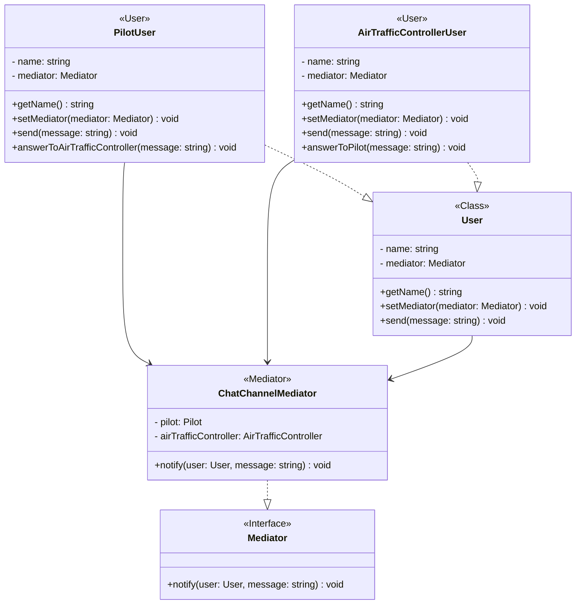

- [El Patrón Mediador](#el-patr%C3%B3n-mediador)
  - [Usando el patrón Mediator](#usando-el-patr%C3%B3n-mediador)
  - [Estructura](#estructura)
  - [Ejemplo](#ejemplo)
  - [Ejemplo en vivo](#ejemplo-en-vivo)
  - [Ejemplo de código](#ejemplo-de-c%C3%B3digo)

# El Patrón Mediador

Mediator es un patrón de diseño de comportamiento que te permite reducir las dependencias caóticas entre objetos. El patrón restringe las comunicaciones directas entre los objetos, forzándolos a colaborar únicamente a través de un objeto mediador.

El patrón Mediador proporciona una autoridad central sobre un grupo de objetos al encapsular cómo interactúan estos objetos. Este modelo es útil para escenarios en los que hay una necesidad de gestionar condiciones complejas en las que cada objeto es consciente de cualquier cambio de estado en cualquier otro objeto del grupo.

El patrón mediador se presenta mejor con una analogía simple: piensa en el control de tráfico aéreo típico. La torre maneja qué aviones pueden despegar y aterrizar porque todas las comunicaciones se realizan desde los aviones a la torre de control, en lugar de entre los aviones.

Un controlador centralizado es clave para el éxito de este sistema y eso es realmente lo que es un mediador.

En términos del mundo real, un mediador encapsula cómo los módulos dispares interactúan entre sí actuando como intermediario. El patrón también promueve un acoplamiento débil al evitar que los objetos se refieran entre sí de manera explícita; en nuestro sistema, esto ayuda a resolver nuestros problemas de interdependencia de módulos.

¿Qué otras ventajas tiene para ofrecer? Bueno, los mediadores permiten que las acciones de cada módulo varíen de forma independiente, por lo que es extremadamente flexible. Si has utilizado anteriormente el patrón Observer (Pub/Sub) para implementar un sistema de difusión de eventos entre los módulos de tu sistema, encontrarás que los mediadores son relativamente fáciles de entender.

Utilizar el patrón Mediador aporta varias ventajas:

- `Principio de responsabilidad única`. Puedes extraer las comunicaciones entre varios componentes dentro de un único sitio, haciéndolo más fácil de comprender y mantener.

- `Principio de abierto/cerrado`. Puedes introducir nuevos mediadores sin tener que cambiar los propios componentes.

- Puedes reducir el acoplamiento entre varios componentes de un programa.

- Puedes reutilizar componentes individuales con mayor facilidad.

## Usando el patrón mediador

Los patrones Mediador son útiles en el desarrollo de formularios complejos. Tomemos como ejemplo una página en la que ingresas opciones para hacer una reserva de vuelo. Una regla simple del Mediador sería: debes ingresar una fecha de salida válida, una fecha de regreso válida, la fecha de regreso debe ser posterior a la fecha de salida, un aeropuerto de salida válido, un aeropuerto de llegada válido, un número válido de viajeros, y solo entonces se puede activar el botón de búsqueda.

Otro ejemplo de Mediador es el de una torre de control en un aeropuerto que coordina las llegadas y salidas de los aviones.

## Estructura



## Ejemplo

```typescript
interface Mediator {
  logMessage(user: User, message: string): void;
}

class ChatChannelMediator implements Mediator {
  private pilot: PilotUser;

  private airTrafficController: AirTrafficControllerUser;

  constructor(pilot: PilotUser, airTrafficController: AirTrafficControllerUser) {
    this.pilot = pilot;
    this.pilot.setMediator(this);

    this.airTrafficController = airTrafficController;
    this.airTrafficController.setMediator(this);
  }

  public logMessage(user: User, message: string): void {
    const time = new Date();
    const sender = user.getName();

    if (user instanceof PilotUser) {
      this.airTrafficController.traceConversation(sender, message, time);
    } else if (user instanceof AirTrafficControllerUser) {
      this.pilot.traceConversation(sender, message, time);
    }
  }
}

class User {
  protected mediator: Mediator;

  private name: string;

  constructor(name: string, mediator?: Mediator) {
    this.name = name;
    this.mediator = mediator!;
  }

  public getName(): string {
    return this.name;
  }

  public setMediator(mediator: Mediator): void {
    this.mediator = mediator;
  }

  public send(message: string): void {
    this.mediator.logMessage(this, message);
  }
}

class PilotUser extends User {
  public type = 'Pilot';

  constructor(name: string, mediator?: Mediator) {
    super(name, mediator);
  }

  public traceConversation(sender: string, message: string, time: Date): void {
    console.log(`${time} [${sender}]: ${message} - [${this.getName()}]: message received, I'll take care of it`);
  }
}

class AirTrafficControllerUser extends User {
  public type = 'Air Traffic Controller';

  constructor(name: string, mediator?: Mediator) {
    super(name, mediator);
  }

  public traceConversation(sender: string, message: string, time: Date): void {
    console.log(`${time} [${sender}]: ${message} - [${this.getName()}]: oki, I will answer you soon`);
  }
}

const pilot = new PilotUser('John');
const airTrafficController = new AirTrafficControllerUser('Jane');

const chatChannel = new ChatChannelMediator(pilot, airTrafficController);

pilot.send('Hello, I am ready for takeoff!');
airTrafficController.send('Roger that, you are cleared for takeoff!');
```

Output:

```text
Tue Jul 22 2025 01:09:16 GMT+0200 (hora de verano de Europa central)
[John]: Hello, I am ready for takeoff! - [Jane]: oki, I will answer you soon

Tue Jul 22 2025 01:09:16 GMT+0200 (hora de verano de Europa central)
[Jane]: Roger that, you are cleared for takeoff! - [John]: message received, I'll take care of it
```

## Ejemplo en vivo

```tsx
/**
 * The Mediator interface declares a method used by components to notify the
 * mediator about various events. The Mediator may react to these events and
 * pass the execution to other components....
```

[Playground Link](https://www.typescriptlang.org/play/?#code/PQKhCgAIUgVALAppAsogJgSwIYBcD2ATpJgHa6KEBm2AxsuorQDbaGIDOk2kAtornj50kAK4cMkAEYBPSLXy8ADvlKJyXApFL5cmKnMGIoMfljxFuU-KNyQAbm0w2uie+twcAdHCSoMOATEvNhy7HR2WkYSkG4eXNik6CaQStgcmn6IAB5Mts6kkFq6SMQKyqrxXibA4GQU1HTIaOZBkADeUJDM+ADmaBnYvYgAFOKUAFyQAKoShAA0fJwcQ4hTHLiEZL0AlFP2+JjoANzgAL7g4KAQ0JAAwqq07BT+rURcmMrMiPzk8vj4JSUPCYdzSRDwbD2ZzEWT-IhYUgg0i9SASdyEbDMFLlFRqDTVaC1FjpLh3SG4cmJNTMFqBSyfJTfX6eV704idSCpLaOF5KTA9XBTAAKAt0s0opy6Sh5eGQ2EwhFgmKoVEwtAe5EI+GY30IUwAgorldhVerNZsdXqJYQpVyFKQNoRRLQgiN+YKRWLcDbFgqlSq1RrVJbdZNIEaA6agxbtWHCDadh0ulzBJhvB7dJAALypb2nLmp+DpryZ3BeCS4OkWQgjNMcHZ2wv1rz+k1m4Naq2UHPcY2B80huN6gvN4veNsDzuhvUVgTVt31xtdC7S0RSZjq7p9AYrYZjOZTX1LQbDdabbZ7ByHEScwsOjZFT7IXNqADukAAInKRsvC-9HTsCQkh7XNxkILxhlwAA5bB+F-JsuX0SADx7MgNkSeh8CoSBRUFRNk3-IsS0naNBy7eMvE2JpNQxFY9FUEZgMYBYTz3RBFj0fg-0LM5YmYGJkNQ4h0NwTDEGwiN+zI6dh0oAi73-FsyyozF6Foyh6IKJj1BYxZ+FPDin240cuQuMzzkua4UgQZAbXkVgMm5fBoUYTJkCkdItyoURSFdAosUwXA5EkjYiG2bgljeQgAHIOBSUTxJIR0jmQcDIHwKQACsmE8QkQGJRyuHsu8ZV0XLJDMdkpgXIgmxlUE5W0OC1jRC8USbB9NhdN0kX4c8thRfSAhrAB+GqRqCJNFKKccvD6l9mv4UzZpLKqa17daggAQlHVcuSUddN1oSAoNg+CrydCKZueURCEKFsFr2y4DqOrdK1q2stqICboqvA4jkIsc1smyxc2+20Vxe1I3pO5iRgM9iBsvfYbyB4jvAhrwen6ZZVjrcdhsMniLlXEknLw8U5libIKCSYrqdK2GihkIFexiyncBizrVCdHqiBGBbkaGqL2XGtka2mlM0VEIFawW4a-uetcNy3aj1NUOiQUY5jwyukXEdWYXek458pm-Ch-rRmaHx1RBsb6EYAAMABJ2i4xA+IAbTd3XCDOABdKY3cN4Y+IAWkgH33bms6Wt-QOplD5B2HoUEMEWABJGLdSKbAAGtkFoNhkEkoKnZJyzwHJrhI3bGMh27BNqZyOn0AZnsmdVk7grZ3MYsjOAp3uRv4256GuudV0BaFtrBpN0Wxt+9kpf-DhZcoQWWsVlflde7uijUxANMILSdd0vX2oX5PjdN-qvzlK3AZt3m7Yd3pnbdj3vd9i--aDyAIc8Zh0gJHaOLY44XUThlfOmAs6QDfAKZg3BHRvh7DIGwaIASkArs9MmvM7Bll7O+XC3obQjBigAKXwPAUgMVlxdT7FGDssYm7EMQB+OuU5WHxnIVQxIiB6FSkYbQCkVJSA0nYR+KklJIQSMQLSUGtYyx+mkiw0eeplzgBUvDGKAAJBRPR4FwUgOEdAcgqCWDEoXbCVBtpCPAKRdRFFZy6IAEp9B7IIPAiwMGiG4OwByiAS4iEscQaxElVT2OXEAA)

## Ejemplo de código

[Example](./mediator.ts)
