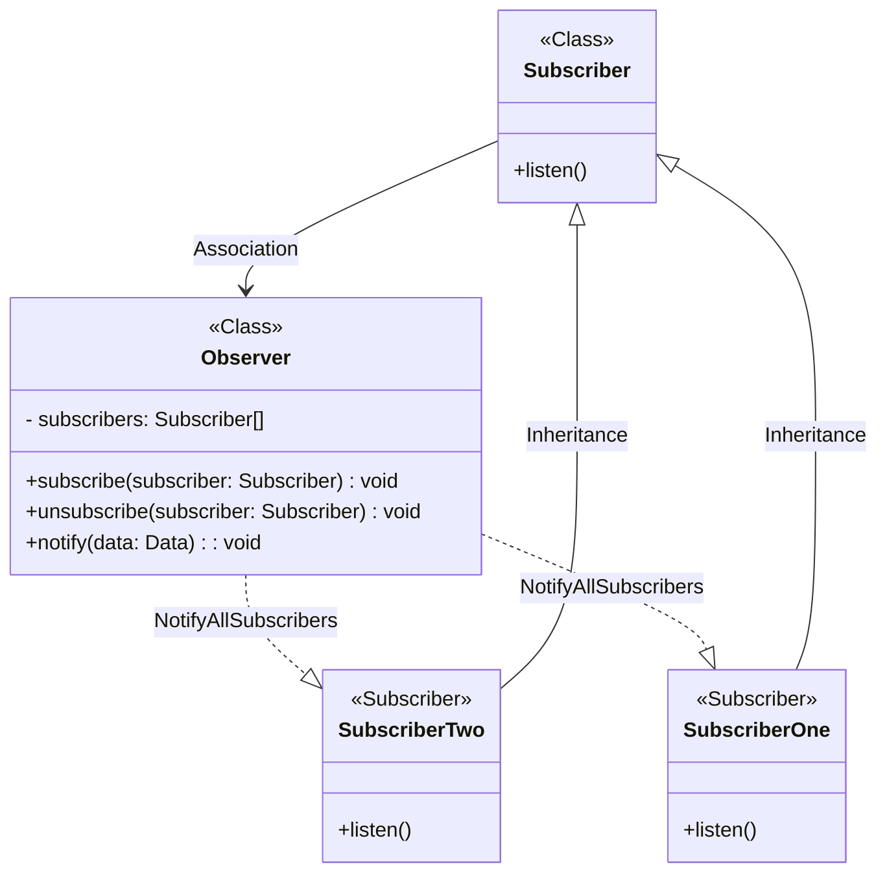

- [El patrón Observador](#el-patr%C3%B3n-observador)
  - [Usando el patrón observador](#usando-el-patr%C3%B3n-observador)
  - [Estructura](#estructura)
  - [Ejemplo](#ejemplo)
  - [Ejemplo en vivo](#ejemplo-en-vivo)
  - [Ejemplo de código](#ejemplo-de-c%C3%B3digo)

# El patrón Observador

Con el patrón observador, podemos suscribir ciertos objetos, los observadores, a otro objeto llamado el observable. ¡Cada vez que ocurre un evento, el observable notifica a todos sus observadores!

Un patron observador generalmente contiene 2 partes importantes:

- `Suscriptores`: Un array de listeners que están suscritos a las notificaciones del notificador.
Realizan la acción con la cual se subscribieron en respuesta a las notificaciones emitidas por el notificador. Todas estas clases deben implementar la misma interfaz de forma que el notificador no esté acoplado a clases concretas.
- `Notificador`: Envía eventos de interés a otros objetos. Esos eventos ocurren cuando el notificador cambia su estado o ejecuta algunos comportamientos. Los notificadores también contienen una infraestructura de suscripción que permite a nuevos y antiguos suscriptores abandonar la lista.
  - `subscribe()`: un método para agregar suscriptores a la lista de suscriptores.
  - `unsubscribe()`: un método para eliminar suscriptores de la lista de suscriptores.
  - `notify()`: un método para notificar a todos los suscriptores cada vez que ocurre un evento específico.

Utilizar el patrón observador aporta varias ventajas:

- Principio de `abierto/cerrado`. Puedes introducir nuevas clases suscriptoras sin tener que cambiar el código de la clase notificador (y viceversa si hay una interfaz notificador).
- Puedes establecer relaciones entre objetos durante el tiempo de ejecución.

## Usando el patrón observador

Puedes experimentar este problema a menudo al trabajar con clases de la interfaz gráfica de usuario. Por ejemplo, si creaste clases personalizadas de botón y quieres permitir al cliente colgar código cliente de tus botones para que se active cuando un usuario pulse un botón.

El patrón Observer permite que cualquier objeto que implemente la interfaz suscriptora pueda suscribirse a notificaciones de eventos en objetos observables o notificadores. Puedes añadir el mecanismo de suscripción a tus botones, permitiendo a los clientes acoplar su código personalizado a través de clases suscriptoras personalizadas.

## Estructura



## Ejemplo

```typescript
interface Subscriber<D = string> {
  listen(data: D): void;
}

class Observer<D = string> {
  private subscribers: Subscriber<D>[] = [];

  constructor() {}

  public subscribe(subscriber: Subscriber<D>): void {
    this.subscribers.push(subscriber);
  }

  public unsubscribe(subscriber: Subscriber<D>): void {
    this.subscribers = this.subscribers.filter((s) => s !== subscriber);
  }

  public notify(data: D): void {
    this.subscribers.forEach((subscriber: Subscriber<D>) => {
      subscriber.listen(data);
    });
  }
}

class SubscriberOne implements Subscriber<string> {
  listen(data: string): void {
    console.log('LOG: One has been notified about: ' + data);
  }
}

class SubscriberTwo implements Subscriber<string> {
  listen(data: string): void {
    console.info('INFO: Two has been notified about: ' + data);
  }
}

const subscriberOne = new SubscriberOne();
const subscriberTwo = new SubscriberTwo();

const publisher = new Observer<string>();

publisher.subscribe(subscriberOne);
publisher.subscribe(subscriberTwo);

publisher.notify('Hello World!');
```

Output:

```text
LOG: One has been notified about: Hello World!
INFO: Two has been notified about: Hello World!
```

## Ejemplo en vivo

```tsx
interface Subscriber<D = string> {
  listen(data: D): void;
}

class Observer<D = string> {
  private subscribers: Subscriber<D>[] = [];

  constructor() {}

  public subscribe(subscriber: Subscriber<...
```

[Playground Link](https://www.typescriptlang.org/play/?#code/JYOwLgpgTgZghgYwgAgMoFcBGBnBVibQA8AIsgLzLZj4gDmAfMgN4BQyyANsNRCABQATOGDgAuZCQCUEgG4B7YIIDcrAL6tWCTnGzZkAeRzRZxMpWq1GLdsgAO+WSJTYsufISjYJGHHgJmDADaALoUyKGqtgjyIJboCGDyUPxSLBq2dljcCFRu-oT8rn4e0D75pVCkDDLICko2HBxgABY8AHTF7gFe7VnYLUUVPVKqHBkcWZg5yOhxw4VdBWVoC4G19YKNTa0dS5X6lLvYnWu9MMCckClFaeRM+gCE5BZno7YT9tnAuSDyYMAYABPIQicSSDaKLZsJrIY6nEo9E4wZIAUUQgyGiM85Wx6woTBhsLyeKg7W4vAEwlE71halpyA0GW0un0vm6ngMIBQwAAtnZOBBeXwwGyzkRLKBrESKZAqWCJJL6JCGkSODE4vJBeT5HR+AByAAyBgA4hIuSgWrpkIQ+Mg-gCLhAtnBMPJ0GAJPrkABqZDUuAMpmaFl6VakgAqAHd5Mg+QKhSKxaSJTQpYTbLK+KDRIq08q5FDturYtgtRB2qAUQaAJIAOQAYgYJNHY1b9LaQPb-oDgM7kK73Z7kN6-QGg+oQ6WwCSOdALeFuVHw3OoBbUqoNdRZ8soK3FxBl+zd62N1O4jOphSWtAD8ujNgTMQlYwz6wrzwb2T9gEsauLe8H4DNACJzn+J4xu877fMBZIOoCIL6gAEhAnCcLGADqyScIIjz6qMQA)

## Ejemplo de código

[observer.ts](./observer.ts)
