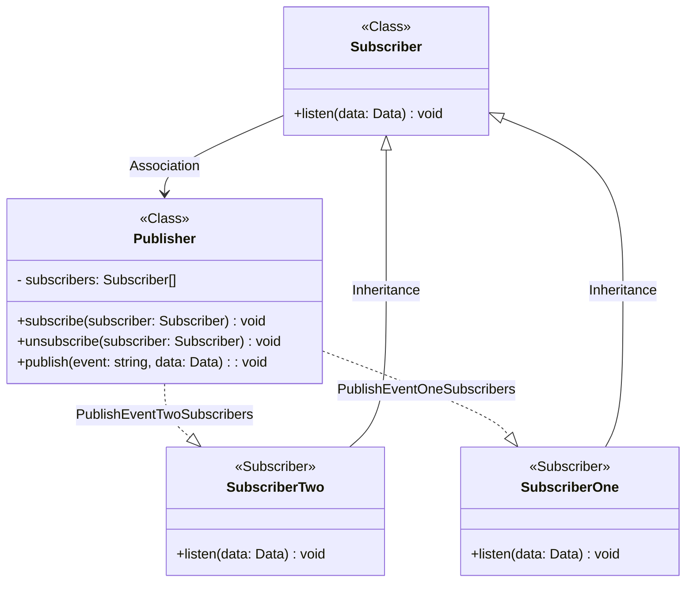

- [El patrón Publicador-Suscriptor](#el-patr%C3%B3n-publicador-suscriptor)
  - [El patron Publicador/Suscriptor](#el-patron-publicadorsuscriptor)
  - [Usando el patrón Publicador/Suscriptor](#usando-el-patr%C3%B3n-publicadorsuscriptor)
  - [Estructura](#estructura)
  - [Ejemplo](#ejemplo)
  - [Ejemplo en vivo](#ejemplo-en-vivo)
  - [Ejemplo de código](#ejemplo-de-c%C3%B3digo)

# El patrón Publicador-Suscriptor

El patrón de mensajería publicar-suscribir (o pub/sub) es un patrón de diseño que proporciona un marco para intercambiar mensajes que permite un acoplamiento débil y la escalabilidad entre el emisor de mensajes (publicadores) y los receptores (suscriptores) en los temas a los que se suscriben.

Los mensajes se envían (empujan) de un publicador a los suscriptores a medida que están disponibles. El anfitrión (publicador) publica mensajes cuando se producen eventos a los suscriptores que están suscritos a esos eventos.

Esto es diferente de los modelos estándar de solicitud/respuesta (extracción) en los que los publicadores comprueban si hay nuevos datos disponibles. Esto hace que el método pub/sub sea el marco más adecuado para la transmisión de datos en tiempo real.

También significa que se pueden construir redes dinámicas a escala de Internet. Sin embargo, construir una infraestructura de mensajería a tal escala puede ser problemático.

## El patron Publicador/Suscriptor

Un patron publicador/suscriptor generalmente contiene 3 partes importantes:

- El `Notificador` o publicador envía eventos de interés a otros objetos. Esos eventos ocurren cuando el notificador cambia su estado o ejecuta algunos comportamientos. Los notificadores contienen una infraestructura de suscripción que permite a nuevos y antiguos suscriptores abandonar la lista.
- La `interfaz Suscriptora`declara la interfaz de notificación. En la mayoría de los casos, consiste en un único método actualizar. El método puede tener varios parámetros que permitan al notificador pasar algunos detalles del evento junto a la actualización.
- Los `Suscriptores` concretos realizan algunas acciones en respuesta a las notificaciones emitidas por el notificador. Todas estas clases deben implementar la misma interfaz de forma que el notificador no esté acoplado a clases concretas.

Utilizar el patrón publicador/suscriptor aporta varias ventajas:

- Principio de `abierto/cerrado`. Puedes introducir nuevas clases suscriptoras sin tener que cambiar el código de la clase notificador (y viceversa si hay una interfaz notificador).
- Puedes establecer relaciones entre objetos durante el tiempo de ejecución.

## Usando el patrón Publicador/Suscriptor

- El patrón Observer permite que cualquier objeto que implemente la interfaz suscriptora pueda suscribirse a notificaciones de eventos en objetos notificadores. Puedes añadir el mecanismo de suscripción a tus botones, permitiendo a los clientes acoplar su código personalizado a través de clases suscriptoras personalizadas.
- Utiliza el patrón cuando algunos objetos de tu aplicación deban observar a otros, pero sólo durante un tiempo limitado o en casos específicos.
- La lista de suscripción es dinámica, por lo que los suscriptores pueden unirse o abandonar la lista cuando lo deseen.

## Estructura



## Ejemplo

```typescript
export type Subscriber<D = any> = (d: D) => void;

export class Publisher<D = any, S extends (d: D) => void = (d: D) => void> {
  private subscribers: Record<string, S[]> = {};

  public getSubscribers(): Record<string, S[]> {
    return this.subscribers;
  }

  public subscribe(event: string, subscriber: S): void {
    if (!this.subscribers[event]) {
      this.subscribers[event] = [];
    }

    this.subscribers[event].push(subscriber);
  }

  public publish(event: string, data: D): void {
    const subscribersForEvent = this.subscribers[event];

    console.log(`Publisher is publishing because ${event}`);

    subscribersForEvent?.forEach((subscriber) => {
      subscriber(data);
    });
  }
}

const subscriberOne: Subscriber<string> = (data: string): void => {
  console.log('Subscriber one has been notified about: ' + data);
};

const subscriberTwo: Subscriber<string> = (data: string): void => {
  console.log('Subscriber two has been notified about: ' + data);
};

const publisher = new Publisher<string, (d: string) => void>();

publisher.subscribe('event:one', subscriberOne);
publisher.subscribe('event:two', subscriberTwo);

publisher.publish('event:one', 'Hello World!');
publisher.publish('event:two', 'Hello World!');
```

Output:

```text
[LOG]: "Publisher is publishing because event:one"
[LOG]: "Subscriber one has been notified about: Hello World!"
[LOG]: "Publisher is publishing because event:two"
[LOG]: "Subscriber two has been notified about: Hello World!"
```

## Ejemplo en vivo

```tsx
interface Subscriber<D = string> {
  listen(data: D): void;
}

class Publisher<D = any> {
  private subscribers: Record<string, Subscriber<D>[]> = {};

  public getSubscribers(): Record<string, Subscr...
```

[Playground Link](https://www.typescriptlang.org/play/?#code/JYOwLgpgTgZghgYwgAgMoFcBGBnBVibQA8AIsgLzLZj4gDmAfMgN4BQyyANsNRCABQATOGDgAuZCQCUEgG4B7YIIDcrAL6tWCTnGzZkABSzdsAC2JlKcEAE8mbDgAd8skSmxZc+QlGwSAShAI8lCCRNS0dAA0aJ54BBYMANoAukyUzGqq7MiOxsAIyHQQYBg48T7Y-DLIgcGh4TSg0bHl3omp9jkcUCXoUCDIYKY8AHQebQm+qhwaOXmY3IUTXgn8ELJ8YBIRzTErFdASZas+pAw1Ckos3cjAMMj8AITDYwftvkkbWylSNxwAoYjbDjOIfbBfTbgFIUZCpGYAuaA14g95TCHfaGjPJmfhonxSBFI3L5QoLEymdZQ7ZUJr0GLCUQSaRyRSCf4A4IgahUMHogBiIQAotTYSjQZNKpCftlAVzsPJOBBRpx5HR+AADIyLHjmKB3fTk3XNZCEBBwdDYFAAEmYmLAag1hM0gPx0GwgqgIq2AH5RjBhYhKXi+QSKF1ARw3VAVTxIAJGXBnYC1MnkBo5tpdPoTocoAB5EAoYAAW0cSpLWxzoeIu3oEZJOsKJnjQhE4lpkUubI5HHliuVqvVAHJcx9kPIi8hTLpTRA+MgQPIwPdgBB2XBMPJ0DTh8gANTIRNpjOaLN6VqnaAAFQA7vI7mWK1XL3nGpEG0bm3G+G2mZ3mm7a4HE5ScFSVFU1X4Uca31MB72nWdCAXJcVxgNcNy3HcJD3Q9jyJdQzzAsBeUlaBCxQSgi1vV8Pgo6pVHlEjozvB8qIgGixymViGKI7kSKNMxoFhajDHyISoHfZoGF41hBL1CUr2g+0xEnCBh32WCKOdeToEUw5lOpMR4PkDTSKvKBWOdOTxIU+TDK2VSizM4cAAkIE4VVkAAdRCThBCeYcdNsvT7OHFSTJc9zPIfXyoH8wLCSAA)

## Ejemplo de código

[Ejemplo](./publisher-subscriber.ts)
