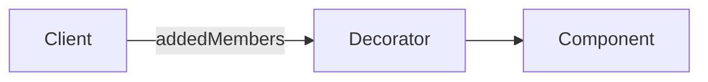

# El patrón Decorador

El patrón Decorador extiende (decora) el comportamiento de un objeto dinámicamente. La capacidad de agregar un nuevo comportamiento en tiempo de ejecución se logra mediante un objeto Decorador que se `envuelve` alrededor del objeto original. Múltiples decoradores pueden agregar o anular la funcionalidad del objeto original.

## Usando el decorador

Un ejemplo de un decorador es la gestión de la seguridad donde los objetos de negocio reciben acceso adicional a información privilegiada dependiendo de los privilegios del usuario autenticado. Por ejemplo, un gerente de recursos humanos puede trabajar con un objeto de empleado que tiene adjunto (es decir, está decorado con) el registro salarial del empleado para que se pueda ver la información salarial.

Los decoradores brindan flexibilidad a los lenguajes de tipo estático al permitir cambios en tiempo de ejecución en lugar de la herencia, que tiene lugar en tiempo de compilación. JavaScript, sin embargo, es un lenguaje dinámico y la capacidad de extender un objeto en tiempo de ejecución está integrada en el propio lenguaje.

Por esta razón, el patrón Decorador es menos relevante para los desarrolladores de JavaScript. En JavaScript, los patrones Extend y Mixin subsumen el patrón Decorador. Puede obtener más información sobre estos y otros patrones de JavaScript moderno en nuestro

## Diagrama

## Participantes

Los objetos que participan en este patrón son:

- `Cliente`: La función mantiene una referencia al Componente decorado.
- `Componente`: Objeto al que se le agrega funcionalidad adicional.
- `Decorador`: `se envuelve alrededor` del Componente manteniendo una referencia a él
dfine una interfaz que se ajusta a la interfaz del Componente
implementa la funcionalidad adicional (addedMembers en el diagrama).

## Ver un ejemplo de código aquí

[Ejemplo](./decorator.ts)