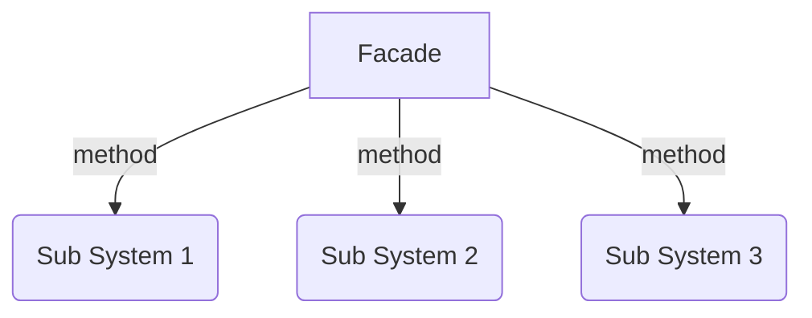

# El patrón Fachada

El patrón Fachada proporciona una interfaz que protege a los clientes de la funcionalidad compleja en uno o más subsistemas. Es un patrón simple que puede parecer trivial pero es poderoso y extremadamente útil. A menudo está presente en sistemas que se construyen en torno a una arquitectura de varias capas.

Cuando levantas una fachada, generalmente estás creando una apariencia externa que oculta una realidad diferente. El patrón de fachada proporciona una interfaz conveniente de nivel superior para un cuerpo de código más grande, ocultando su verdadera complejidad subyacente. Piénsalo como simplificar la API que se presenta a otros desarrolladores.

Esto nos permite interactuar con la fachada en lugar del subsistema detrás de escena.

La razón por la que la fachada es de interés es por su capacidad para ocultar detalles específicos de la implementación sobre un cuerpo de funcionalidad contenido en módulos individuales. La implementación de un módulo puede cambiar sin que los clientes realmente lo sepan.

Como puedes ver, nuestro módulo contiene una serie de métodos que se han definido de forma privada. Luego se utiliza una fachada para proporcionar una API mucho más simple para acceder a estos métodos.

## Usando la fachada

La intención de la Fachada es proporcionar una interfaz de alto nivel (propiedades y métodos) que haga que un subsistema o conjunto de herramientas sea fácil de usar para el cliente.

En el servidor, en una aplicación web de varias capas, con frecuencia tienes una capa de presentación que es un cliente de una capa de servicio. La comunicación entre estas dos capas se lleva a cabo a través de una API bien definida. Esta API, o fachada, oculta las complejidades de los objetos de negocio y sus interacciones de la capa de presentación.

Otra área donde se utilizan las Fachadas es en la refactorización. Supongamos que tienes un conjunto confuso o desordenado de objetos heredados de los que el cliente no debería preocuparse. Puedes ocultar este código detrás de una Fachada. La Fachada expone solo lo necesario y presenta una interfaz más limpia y fácil de usar.

Las Fachadas se combinan frecuentemente con otros patrones de diseño. Las propias Fachadas a menudo se implementan como fábricas singleton.

## Diagrama

## Ver un ejemplo de código
[Ejemplo](./facade.ts)