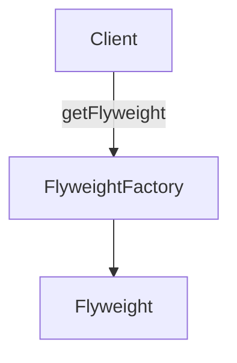

# Peso Ligero

El patrón Peso Ligero conserva la memoria al compartir de manera eficiente una gran cantidad de objetos de grano fino. Los objetos de peso ligero compartidos son inmutables, es decir, no se pueden cambiar, ya que representan las características que se comparten con otros objetos.

## Usar Peso Ligero

Esencialmente, Peso Ligero es una `técnica de normalización de objetos` en la que las propiedades comunes se factorizan en objetos de peso ligero compartidos. (Nota: la idea es similar a la normalización del modelo de datos, un proceso en el que el modelador intenta minimizar la redundancia).

Un ejemplo del patrón Peso Ligero se encuentra dentro del propio motor de JavaScript, que mantiene una lista de cadenas inmutables que se comparten en toda la aplicación.

Otros ejemplos incluyen caracteres y estilos de línea en un procesador de textos, o `receptores de dígitos` en una aplicación de red telefónica pública conmutada. Encontrarás pesos ligeros principalmente en aplicaciones de tipo de utilidad como procesadores de texto, programas de gráficos y aplicaciones de red; se usan con menos frecuencia in aplicaciones de tipo empresarial basadas en datos.

## Diagrama

## Participantes

Los objetos que participan en este patrón son:

- `Cliente`: Llama a FlyweightFactory para obtener objetos de peso ligero.
- `FlyweightFactory`: Crea y gestiona objetos de peso ligero
si se solicita y no existe un peso ligero, creará uno
almacena los pesos ligeros recién creados para futuras solicitudes.
- `Flyweight`: Mantiene datos intrínsecos para ser compartidos en toda la aplicación.

## Ver un ejemplo de código
[Ejemplo](./fly-weight .ts)