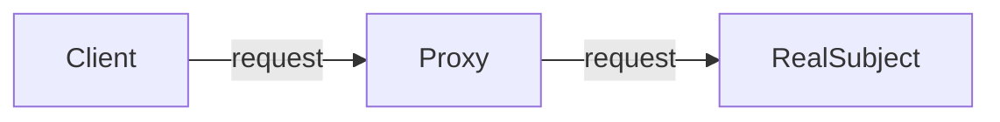

# El patrón Proxy

El patrón Proxy proporciona un objeto sustituto o marcador de posición para otro objeto y controla el acceso a este otro objeto.

Con un objeto Proxy, obtenemos más control sobre las interacciones con ciertos objetos. Un objeto proxy puede determinar el comportamiento cada vez que interactuamos con el objeto, por ejemplo, cuando obtenemos un valor o establecemos un valor.

## Usando el proxy

En la programación orientada a objetos, los objetos realizan el trabajo que anuncian a través de su interfaz (propiedades y métodos). Los clientes de estos objetos esperan que este trabajo se realice de forma rápida y eficiente. Sin embargo, hay situaciones en las que un objeto está severamente restringido y no puede cumplir con su responsabilidad. Normalmente, esto ocurre cuando hay una dependencia de un recurso remoto (lo que resulta en latencia de red) o cuando un objeto tarda mucho en cargarse.

En situaciones como estas, se aplica el patrón Proxy y se crea un objeto proxy que "sustituye" al objeto original. El Proxy reenvía la solicitud a un objeto de destino. La interfaz del objeto Proxy es la misma que la del objeto original y es posible que los clientes ni siquiera se den cuenta de que están tratando con un proxy en lugar del objeto real.

## Diagrama

## Participantes

Los objetos que participan en este patrón son:

- `Cliente`: Llama al Proxy para solicitar una operación.
- `Proxy`: Proporciona una interfaz similar al objeto real, mantiene una referencia que permite al proxy acceder al objeto real, maneja las solicitudes y las reenvía al objeto real.
- `RealSubject`: Define el objeto real para el que se solicita el servicio.